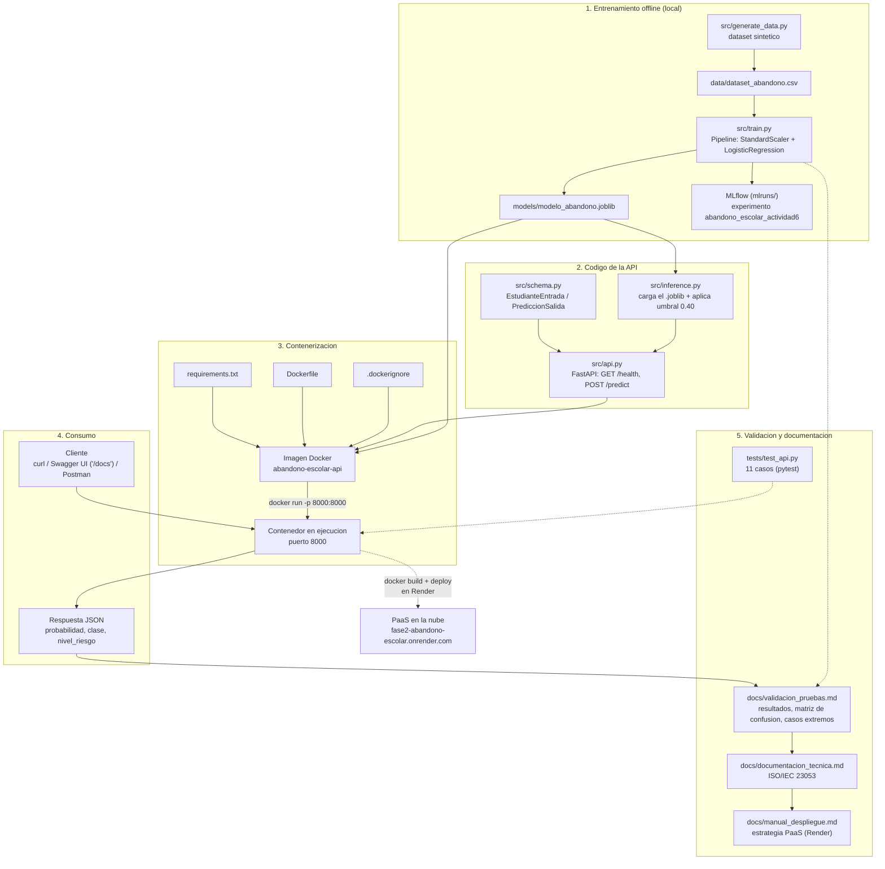

# API de Predicción de Abandono Escolar

Servicio de inferencia del modelo de Regresión Logística desarrollado en la
Actividad 6 del curso **Gestión de Proyectos de Inteligencia Artificial**
(Universidad Tecmilenio). Esta Fase 2 contieneriza el modelo, lo expone como API
REST, valida su funcionamiento local y la despliega en la nube.

> Alumno: Alejandro Islas López (matrícula T07136481).

**API desplegada y disponible públicamente en Render:**
**https://fase2-abandono-escolar.onrender.com** — documentación interactiva en
[`/docs`](https://fase2-abandono-escolar.onrender.com/docs).

- Documentación interactiva (Swagger UI): https://fase2-abandono-escolar.onrender.com/docs
- Health check: https://fase2-abandono-escolar.onrender.com/health

> El plan gratuito de Render suspende el servicio tras inactividad; la primera
> petición después de un rato puede tardar ~30-50 s en responder mientras despierta.

## Entregables de la Fase 2

Mapa rápido de los requisitos de la actividad y dónde verificar cada uno en este
repositorio:

| Requisito | Dónde verificarlo |
|---|---|
| Repositorio en GitHub | Este repositorio |
| Código fuente completo del proyecto | Carpeta [`src/`](src/) — ver "Contenido del repositorio" |
| Dockerfile funcional | [`Dockerfile`](Dockerfile) — ver "Contenerización con Docker" |
| Archivos de configuración necesarios | [`requirements.txt`](requirements.txt), [`.dockerignore`](.dockerignore), [`.gitignore`](.gitignore) |
| Evidencia de integración (API, endpoints) | Sección "Evidencia de integración (API y endpoints)" |
| Contenedor Docker funcional | Sección "Contenerización con Docker" + [`docs/validacion_pruebas.md`](docs/validacion_pruebas.md) sección 4 |
| Imagen construida correctamente | [`docs/validacion_pruebas.md`](docs/validacion_pruebas.md) sección 4.1 |
| Ejecución local comprobable | Secciones "Ejecución del servicio" y "Contenerización con Docker" |
| Manual de despliegue en la nube | [`docs/manual_despliegue.md`](docs/manual_despliegue.md) |
| Descripción del proceso paso a paso | [`docs/manual_despliegue.md`](docs/manual_despliegue.md), secciones 2 a 4 |
| Requerimientos técnicos | Sección "Requisitos técnicos" + [`docs/manual_despliegue.md`](docs/manual_despliegue.md) sección 1 |
| Estrategia de despliegue (contenedores, PaaS) — **ejecutada, API en vivo** | Sección "Despliegue en la nube (Render)" + [`docs/manual_despliegue.md`](docs/manual_despliegue.md) sección 4 |
| Uso de herramientas de documentación (IA generativa) | [`docs/manual_despliegue.md`](docs/manual_despliegue.md) sección 6 |
| Documento de validación y pruebas | [`docs/validacion_pruebas.md`](docs/validacion_pruebas.md) |
| Pruebas funcionales realizadas | Sección "Pruebas funcionales y casos extremos" + [`docs/validacion_pruebas.md`](docs/validacion_pruebas.md) sección 2 |
| Casos extremos evaluados | Sección "Pruebas funcionales y casos extremos" + [`docs/validacion_pruebas.md`](docs/validacion_pruebas.md) sección 2.2 |
| Resultados y conclusiones | [`docs/validacion_pruebas.md`](docs/validacion_pruebas.md) sección 5 |

---

## Actividad 8 — Monitorización, Mantenimiento y Gobernanza Operativa

Construida sobre esta misma Fase 2 (mismo modelo, dataset y API en producción). Todo
el contenido nuevo vive en [`actividad8/`](actividad8/), con su propio README e
índice de entregables.

| Requisito (rúbrica) | Dónde verificarlo |
|---|---|
| Documento técnico (indicadores, alertas, dashboards, runbooks, drift, respuesta automatizada) | [`actividad8/documento_tecnico.md`](actividad8/documento_tecnico.md) |
| Evidencia de implementación (capturas MLflow, métricas, alertas, dashboards) | [`actividad8/evidencia_implementacion.md`](actividad8/evidencia_implementacion.md) |
| Simulación de incidentes (≥2, con runbooks ejecutados y resultados) | [`actividad8/incidentes/registro_incidentes.md`](actividad8/incidentes/registro_incidentes.md) |
| Código y configuración (monitoreo, alertas, automatización) | [`actividad8/scripts/`](actividad8/scripts/) |

**Lo más relevante:** los 2 incidentes simulados y la detección de drift se
ejecutaron realmente contra la API en producción
(`fase2-abandono-escolar.onrender.com`) — no son solo procedimiento documentado. Ver
[`actividad8/README.md`](actividad8/README.md) para el detalle completo.

---

## Contenido del repositorio

```
├── src/                    # Codigo fuente (generacion de datos, entrenamiento, API)
├── models/                 # Artefacto serializado del modelo (.joblib)
├── data/                   # Dataset sintetico de entrenamiento
├── tests/                  # Pruebas automatizadas (pytest)
├── docs/                   # Documentacion tecnica, manual de despliegue y validacion
├── actividad8/             # Actividad 8: monitorizacion y gobernanza operativa
│   ├── documento_tecnico.md
│   ├── scripts/            # monitor.py, alertas_config.yaml, drift, rollback
│   ├── evidencia/          # capturas MLflow, reporte de drift, log de alertas
│   └── incidentes/         # registro de incidentes simulados
├── Dockerfile
├── .dockerignore
└── requirements.txt
```

El código fuente completo del proyecto está en `src/` (generación de datos,
entrenamiento y API) y `tests/` (pruebas). Los archivos de configuración necesarios
para instalar dependencias y contenerizar son `requirements.txt`, `Dockerfile` y
`.dockerignore`.

## Diagrama de flujo

Flujo completo desde el entrenamiento offline hasta el consumo de la API y su
documentación, mostrando cómo se conectan el código fuente, el `Dockerfile` y los
archivos de configuración, el contenedor en ejecución y los resultados/documentación
generados.



## Requisitos técnicos

- Python 3.11 o superior
- Docker (para contenerización y ejecución local del contenedor)

## Instalación local

```bash
python3.11 -m venv .venv
source .venv/bin/activate      # En Windows: .venv\Scripts\activate
pip install -r requirements.txt
```

## Generación de datos y entrenamiento del modelo

> No se dispuso del dataset original de la Actividad 6; se genera un dataset
> sintético equivalente y reproducible. Ver `docs/documentacion_tecnica.md` (sección 2)
> para el detalle y la justificación.

```bash
python -m src.generate_data
python -m src.train
```

Genera el artefacto en `models/modelo_abandono.joblib` y registra la corrida en
MLflow bajo el experimento `abandono_escolar_actividad6`.

## Ejecución del servicio

```bash
uvicorn src.api:app --reload
```

La documentación interactiva queda disponible en `http://localhost:8000/docs`.

## Evidencia de integración (API y endpoints)

El servicio expone dos endpoints (`GET /health`, `POST /predict`) documentados
automáticamente por FastAPI. La captura y el ejemplo de consumo siguientes muestran la
integración funcionando de extremo a extremo: esquema de entrada/salida, validación y
respuesta del modelo.


```bash
curl -X POST http://localhost:8000/predict \
  -H "Content-Type: application/json" \
  -d '{"promedio_academico": 7.8, "materias_reprobadas": 2, "asistencia": 0.82,
       "condicion_beca": 1, "distancia_campus": 12.5, "horas_trabajo_semanales": 20,
       "semestre_actual": 4, "modalidad": 0}'
```

Respuesta esperada:

```json
{
  "probabilidad_abandono": 0.63,
  "clase_predicha": 1,
  "umbral_aplicado": 0.40,
  "nivel_riesgo": "alto"
}
```

Evidencia adicional de integración (peticiones reales contra el contenedor Docker en
ejecución, con logs de Uvicorn) está documentada en
[`docs/validacion_pruebas.md`](docs/validacion_pruebas.md), secciones 3 y 4.3.

## Resultados de la evaluación del modelo

> Métricas obtenidas sobre el conjunto de prueba (20%, `random_state=42`) del dataset
> sintético. Detalle completo y metodología en `docs/documentacion_tecnica.md` y
> `docs/validacion_pruebas.md`.

**Métricas generales (umbral 0.5, entrenamiento):**

| Métrica | Valor obtenido | Referencia Actividad 6 |
|---------|----------------|------------------------|
| F1 (prueba) | 0.8493 | 0.8456 |
| AUC-ROC | 0.9464 | 0.8660 |
| F1 media (5-fold CV) | 0.8155 | 0.8376 |
| Desv. estándar (5-fold CV) | 0.0422 | 0.0226 |

**Distribución de clases (dataset completo, 1000 registros):**

| Clase | Registros | Proporción |
|-------|-----------|------------|
| Continúa (0) | 641 | 64.1% |
| Abandona (1) | 359 | 35.9% |

**Matriz de confusión (umbral de decisión 0.40, el aplicado en producción):**

| | Predicho: continúa | Predicho: abandona |
|---|---|---|
| **Real: continúa** | 105 (TN) | 23 (FP) |
| **Real: abandona** | 7 (FN) | 65 (TP) |

**Reporte de clasificación (umbral 0.40):**

| Clase | Precision | Recall | F1 |
|-------|-----------|--------|-----|
| Continúa (0) | 0.9375 | 0.8203 | 0.8750 |
| Abandona (1) | 0.7386 | 0.9028 | 0.8125 |
| **Accuracy global** | | | **0.8500** |

**Análisis de umbral** (por qué se usa 0.40 y no 0.5 por defecto):

| Umbral | F1 | Precision | Recall |
|--------|-----|-----------|--------|
| 0.30 | 0.8023 | 0.6900 | 0.9583 |
| **0.40** | **0.8125** | 0.7386 | **0.9028** |
| 0.50 | 0.8493 | 0.8378 | 0.8611 |
| 0.60 | 0.8060 | 0.8710 | 0.7500 |

El umbral 0.40 prioriza el *recall* (detectar la mayor cantidad posible de estudiantes
en riesgo real de abandono) a costa de algo de precisión, lo cual es preferible en este
caso de uso: es más costoso no detectar a un estudiante que abandonará que generar
algunas alertas de más para revisión de un coordinador.

**Coeficientes del modelo** (Regresión Logística; variables numéricas escaladas):

| Variable | Coeficiente | Efecto sobre el riesgo |
|----------|-------------|-------------------------|
| condicion_beca | -1.6265 | Disminuye |
| promedio_academico | -1.4601 | Disminuye |
| materias_reprobadas | +1.3360 | Aumenta |
| horas_trabajo_semanales | +1.1902 | Aumenta |
| asistencia | -0.7143 | Disminuye |
| distancia_campus | +0.6901 | Aumenta |
| modalidad (en línea) | +0.6280 | Aumenta |
| semestre_actual | -0.1112 | Disminuye |

## Contenerización con Docker

```bash
docker build -t abandono-escolar-api .
docker run -d -p 8000:8000 --name abandono-escolar-api abandono-escolar-api
```

El `Dockerfile` es funcional: la imagen construye sin errores y el contenedor sirve la
API de forma idéntica al entorno local. Evidencia real de la construcción de la imagen
y de la ejecución del contenedor (logs, códigos de respuesta de `/health` y
`/predict`) está documentada en
[`docs/validacion_pruebas.md`](docs/validacion_pruebas.md), sección 4.

## Despliegue en la nube (Render)

La API está desplegada realmente en Render a partir de este mismo `Dockerfile`, sin
pasos manuales adicionales: **https://fase2-abandono-escolar.onrender.com**

```bash
curl https://fase2-abandono-escolar.onrender.com/health
# {"estado":"operativo"}

curl -X POST https://fase2-abandono-escolar.onrender.com/predict \
  -H "Content-Type: application/json" \
  -d '{"promedio_academico": 5.5, "materias_reprobadas": 4, "asistencia": 0.60,
       "condicion_beca": 0, "distancia_campus": 30.0, "horas_trabajo_semanales": 35,
       "semestre_actual": 2, "modalidad": 1}'
```

El único cambio de código necesario para el despliegue fue leer el puerto dinámico que
asigna Render (`$PORT`) en el `CMD` del `Dockerfile`, en lugar del puerto fijo 8000
usado para ejecución local. Procedimiento completo, configuración del servicio y
evidencia del log de despliegue: [`docs/manual_despliegue.md`](docs/manual_despliegue.md)
sección 4 y [`docs/validacion_pruebas.md`](docs/validacion_pruebas.md) sección 6.

## Ejemplos de predicción

Cinco casos de referencia, probados contra la API en vivo, que ilustran distintos
perfiles de riesgo y cómo interactúan las variables del modelo. Cámbiales la URL por
`http://localhost:8000` si estás probando en local.

**1. Riesgo muy alto** — mal desempeño académico, sin apoyo, trabaja muchas horas

```bash
curl -X POST https://fase2-abandono-escolar.onrender.com/predict \
  -H "Content-Type: application/json" \
  -d '{"promedio_academico": 5.0, "materias_reprobadas": 5, "asistencia": 0.55,
       "condicion_beca": 0, "distancia_campus": 40.0, "horas_trabajo_semanales": 40,
       "semestre_actual": 2, "modalidad": 1}'
# {"probabilidad_abandono":1.0,"clase_predicha":1,"umbral_aplicado":0.4,"nivel_riesgo":"alto"}
```

**2. Riesgo muy bajo** — excelente desempeño, con apoyo

```bash
curl -X POST https://fase2-abandono-escolar.onrender.com/predict \
  -H "Content-Type: application/json" \
  -d '{"promedio_academico": 9.5, "materias_reprobadas": 0, "asistencia": 0.99,
       "condicion_beca": 1, "distancia_campus": 1.0, "horas_trabajo_semanales": 0,
       "semestre_actual": 6, "modalidad": 0}'
# {"probabilidad_abandono":0.0001,"clase_predicha":0,"umbral_aplicado":0.4,"nivel_riesgo":"bajo"}
```

**3. Caso límite** — justo cerca del umbral de decisión (0.40)

```bash
curl -X POST https://fase2-abandono-escolar.onrender.com/predict \
  -H "Content-Type: application/json" \
  -d '{"promedio_academico": 7.0, "materias_reprobadas": 1, "asistencia": 0.80,
       "condicion_beca": 0, "distancia_campus": 15.0, "horas_trabajo_semanales": 15,
       "semestre_actual": 3, "modalidad": 0}'
# {"probabilidad_abandono":0.4781,"clase_predicha":1,"umbral_aplicado":0.4,"nivel_riesgo":"medio"}
```

**4. La beca no siempre compensa** — mal desempeño académico aunque tenga beca

```bash
curl -X POST https://fase2-abandono-escolar.onrender.com/predict \
  -H "Content-Type: application/json" \
  -d '{"promedio_academico": 5.5, "materias_reprobadas": 3, "asistencia": 0.65,
       "condicion_beca": 1, "distancia_campus": 10.0, "horas_trabajo_semanales": 10,
       "semestre_actual": 5, "modalidad": 0}'
# {"probabilidad_abandono":0.9205,"clase_predicha":1,"umbral_aplicado":0.4,"nivel_riesgo":"alto"}
```

**5. Buen promedio pero mucha carga laboral y modalidad en línea**

```bash
curl -X POST https://fase2-abandono-escolar.onrender.com/predict \
  -H "Content-Type: application/json" \
  -d '{"promedio_academico": 8.2, "materias_reprobadas": 0, "asistencia": 0.75,
       "condicion_beca": 0, "distancia_campus": 5.0, "horas_trabajo_semanales": 38,
       "semestre_actual": 7, "modalidad": 1}'
# {"probabilidad_abandono":0.3978,"clase_predicha":0,"umbral_aplicado":0.4,"nivel_riesgo":"bajo"}
```

Los casos 3 y 5 son útiles para mostrar el efecto del umbral 0.40: quedan justo a un
lado y otro de la frontera de decisión, a diferencia de los casos 1, 2 y 4, que son
inequívocos en cualquier umbral razonable.

## Pruebas funcionales y casos extremos

```bash
pytest tests/ -v
```

La suite (`tests/test_api.py`, 11 casos) se divide en dos grupos, alineados con el
documento de validación ([`docs/validacion_pruebas.md`](docs/validacion_pruebas.md)):

### Pruebas funcionales realizadas

- **Disponibilidad del servicio:** `GET /health` responde correctamente.
- **Predicción con perfil de riesgo alto:** entrada con bajo promedio, varias materias
  reprobadas, baja asistencia y muchas horas de trabajo.
- **Predicción con perfil de riesgo bajo:** entrada con buen promedio, sin materias
  reprobadas, alta asistencia y con beca.

### Casos extremos evaluados

- **Entrada incompleta:** solo se envía uno de los ocho campos requeridos.
- **Valor fuera de rango superior:** `promedio_academico` mayor a 10.
- **Valor fuera de rango inferior:** `asistencia` negativa.
- **Valor negativo en un campo no negativo:** `materias_reprobadas` menor a 0.
- **Valor fuera del enum permitido:** `modalidad` con un valor distinto de 0 o 1.
- **Valores límite exactos:** `asistencia` en 0.0 y en 1.0 (deben aceptarse).
- **Valor fuera de rango superior:** `horas_trabajo_semanales` mayor a 168.
- **Modelo no disponible:** simula la ausencia del artefacto `.joblib` y verifica que
  `/predict` falle de forma controlada en lugar de tumbar el servicio.

Resultados detallados y conclusiones de estas pruebas:
[`docs/validacion_pruebas.md`](docs/validacion_pruebas.md), sección 5.

## Documentación completa

- [`docs/manual_despliegue.md`](docs/manual_despliegue.md) — **Manual de despliegue en
  la nube**: requerimientos técnicos, descripción del proceso paso a paso (ejecución
  local, construcción de la imagen, publicación en GitHub), estrategia de despliegue
  (contenedores + PaaS con Render) y uso de herramientas de IA generativa para la
  documentación.
- [`docs/documentacion_tecnica.md`](docs/documentacion_tecnica.md) — documentación
  alineada con ISO/IEC 23053: propósito, diseño, datos, verificación, operación y fin
  de vida útil del sistema.
- [`docs/validacion_pruebas.md`](docs/validacion_pruebas.md) — **Documento de
  validación y pruebas**: pruebas funcionales realizadas, casos extremos evaluados,
  evidencia de integración y contenerización, resultados y conclusiones.
