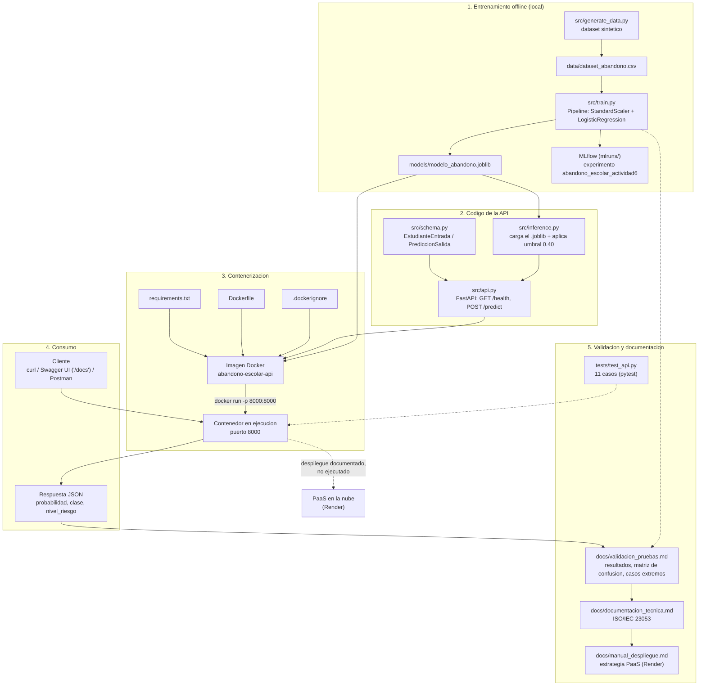
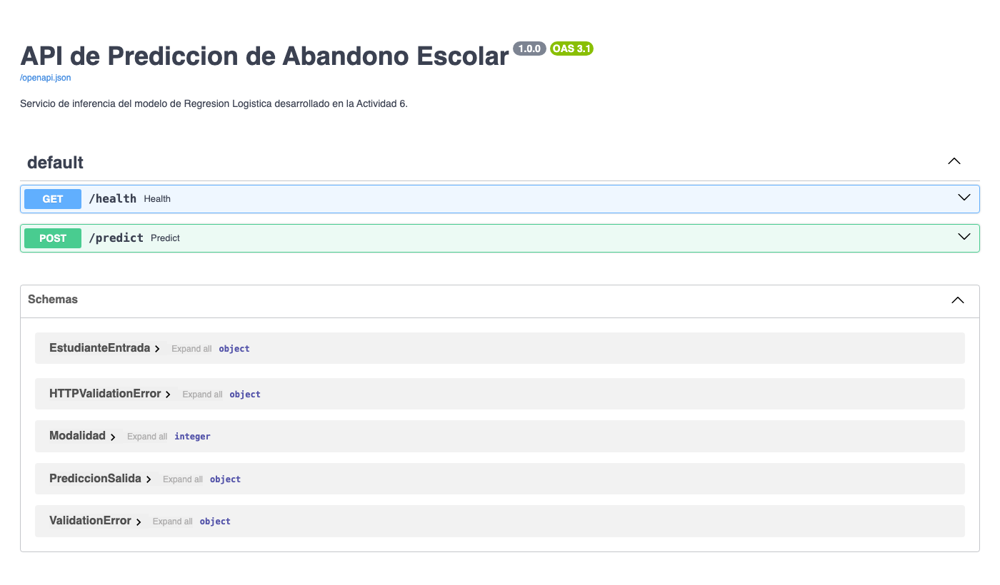

# API de Predicción de Abandono Escolar

Servicio de inferencia del modelo de Regresión Logística desarrollado en la
Actividad 6 del curso **Gestión de Proyectos de Inteligencia Artificial**
(Universidad Tecmilenio). Esta Fase 2 contieneriza el modelo, lo expone como API
REST, valida su funcionamiento local y documenta la estrategia de despliegue en la
nube.

> Alumno: Alejandro Islas López (matrícula T07136481).

## Contenido del repositorio

```
├── src/                    # Codigo fuente (generacion de datos, entrenamiento, API)
├── models/                 # Artefacto serializado del modelo (.joblib)
├── data/                   # Dataset sintetico de entrenamiento
├── tests/                  # Pruebas automatizadas (pytest)
├── docs/                   # Documentacion tecnica, manual de despliegue y validacion
├── Dockerfile
├── .dockerignore
└── requirements.txt
```

## Diagrama de flujo

Flujo completo desde el entrenamiento offline hasta el consumo de la API y su
documentación, mostrando cómo se conectan el código fuente, el `Dockerfile` y los
archivos de configuración, el contenedor en ejecución y los resultados/documentación
generados.



## Requisitos

- Python 3.11 o superior
- Docker (para contenerización y ejecución local del contenedor)

## Instalación local

```bash
python3.11 -m venv .venv
source .venv/bin/activate      # En Windows: .venv\Scripts\activate
pip install -r requirements.txt
```

## Generación de datos y entrenamiento del modelo

> No se dispuso del dataset original de la Actividad 6; se genera un dataset
> sintético equivalente y reproducible. Ver `docs/documentacion_tecnica.md` (sección 2)
> para el detalle y la justificación.

```bash
python -m src.generate_data
python -m src.train
```

Genera el artefacto en `models/modelo_abandono.joblib` y registra la corrida en
MLflow bajo el experimento `abandono_escolar_actividad6`.

## Ejecución del servicio

```bash
uvicorn src.api:app --reload
```

La documentación interactiva queda disponible en `http://localhost:8000/docs`.



## Consumo de la API

```bash
curl -X POST http://localhost:8000/predict \
  -H "Content-Type: application/json" \
  -d '{"promedio_academico": 7.8, "materias_reprobadas": 2, "asistencia": 0.82,
       "condicion_beca": 1, "distancia_campus": 12.5, "horas_trabajo_semanales": 20,
       "semestre_actual": 4, "modalidad": 0}'
```

Respuesta esperada:

```json
{
  "probabilidad_abandono": 0.63,
  "clase_predicha": 1,
  "umbral_aplicado": 0.40,
  "nivel_riesgo": "alto"
}
```

## Resultados de la evaluación del modelo

> Métricas obtenidas sobre el conjunto de prueba (20%, `random_state=42`) del dataset
> sintético. Detalle completo y metodología en `docs/documentacion_tecnica.md` y
> `docs/validacion_pruebas.md`.

**Métricas generales (umbral 0.5, entrenamiento):**

| Métrica | Valor obtenido | Referencia Actividad 6 |
|---------|----------------|------------------------|
| F1 (prueba) | 0.8493 | 0.8456 |
| AUC-ROC | 0.9464 | 0.8660 |
| F1 media (5-fold CV) | 0.8155 | 0.8376 |
| Desv. estándar (5-fold CV) | 0.0422 | 0.0226 |

**Distribución de clases (dataset completo, 1000 registros):**

| Clase | Registros | Proporción |
|-------|-----------|------------|
| Continúa (0) | 641 | 64.1% |
| Abandona (1) | 359 | 35.9% |

**Matriz de confusión (umbral de decisión 0.40, el aplicado en producción):**

| | Predicho: continúa | Predicho: abandona |
|---|---|---|
| **Real: continúa** | 105 (TN) | 23 (FP) |
| **Real: abandona** | 7 (FN) | 65 (TP) |

**Reporte de clasificación (umbral 0.40):**

| Clase | Precision | Recall | F1 |
|-------|-----------|--------|-----|
| Continúa (0) | 0.9375 | 0.8203 | 0.8750 |
| Abandona (1) | 0.7386 | 0.9028 | 0.8125 |
| **Accuracy global** | | | **0.8500** |

**Análisis de umbral** (por qué se usa 0.40 y no 0.5 por defecto):

| Umbral | F1 | Precision | Recall |
|--------|-----|-----------|--------|
| 0.30 | 0.8023 | 0.6900 | 0.9583 |
| **0.40** | **0.8125** | 0.7386 | **0.9028** |
| 0.50 | 0.8493 | 0.8378 | 0.8611 |
| 0.60 | 0.8060 | 0.8710 | 0.7500 |

El umbral 0.40 prioriza el *recall* (detectar la mayor cantidad posible de estudiantes
en riesgo real de abandono) a costa de algo de precisión, lo cual es preferible en este
caso de uso: es más costoso no detectar a un estudiante que abandonará que generar
algunas alertas de más para revisión de un coordinador.

**Coeficientes del modelo** (Regresión Logística; variables numéricas escaladas):

| Variable | Coeficiente | Efecto sobre el riesgo |
|----------|-------------|-------------------------|
| condicion_beca | -1.6265 | Disminuye |
| promedio_academico | -1.4601 | Disminuye |
| materias_reprobadas | +1.3360 | Aumenta |
| horas_trabajo_semanales | +1.1902 | Aumenta |
| asistencia | -0.7143 | Disminuye |
| distancia_campus | +0.6901 | Aumenta |
| modalidad (en línea) | +0.6280 | Aumenta |
| semestre_actual | -0.1112 | Disminuye |

## Contenerización

```bash
docker build -t abandono-escolar-api .
docker run -d -p 8000:8000 --name abandono-escolar-api abandono-escolar-api
```

## Pruebas

```bash
pytest tests/ -v
```

La suite (`tests/test_api.py`) cubre 11 casos funcionales y de borde:

- **Disponibilidad del servicio:** `GET /health` responde correctamente.
- **Predicción con perfil de riesgo alto:** entrada con bajo promedio, varias materias
  reprobadas, baja asistencia y muchas horas de trabajo.
- **Predicción con perfil de riesgo bajo:** entrada con buen promedio, sin materias
  reprobadas, alta asistencia y con beca.
- **Entrada incompleta:** solo se envía uno de los ocho campos requeridos.
- **Valor fuera de rango superior:** `promedio_academico` mayor a 10.
- **Valor fuera de rango inferior:** `asistencia` negativa.
- **Valor negativo en un campo no negativo:** `materias_reprobadas` menor a 0.
- **Valor fuera del enum permitido:** `modalidad` con un valor distinto de 0 o 1.
- **Valores límite exactos:** `asistencia` en 0.0 y en 1.0 (deben aceptarse).
- **Valor fuera de rango superior:** `horas_trabajo_semanales` mayor a 168.
- **Modelo no disponible:** simula la ausencia del artefacto `.joblib` y verifica que
  `/predict` falle de forma controlada en lugar de tumbar el servicio.

## Documentación adicional

- [`docs/documentacion_tecnica.md`](docs/documentacion_tecnica.md) — documentación
  alineada con ISO/IEC 23053: propósito, diseño, datos, verificación, operación y fin
  de vida útil del sistema.
- [`docs/manual_despliegue.md`](docs/manual_despliegue.md) — manual paso a paso de
  ejecución local, contenerización y estrategia de despliegue en PaaS (Render).
- [`docs/validacion_pruebas.md`](docs/validacion_pruebas.md) — pruebas funcionales,
  casos extremos evaluados, resultados y conclusiones.
