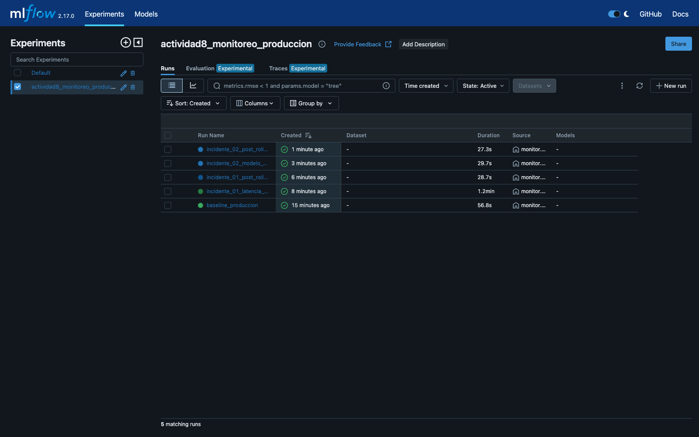
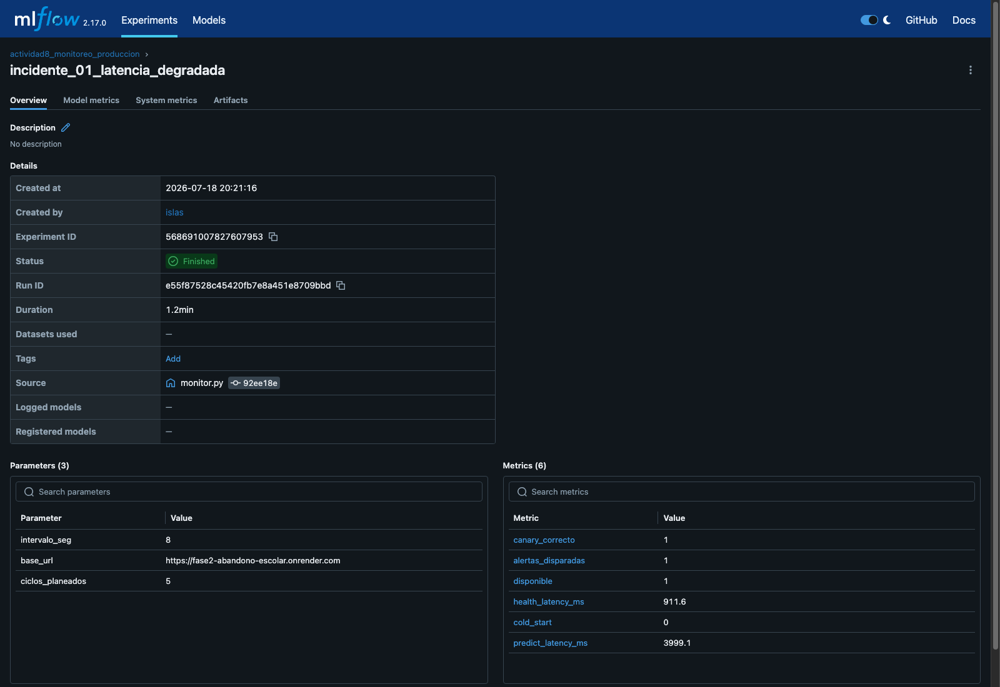
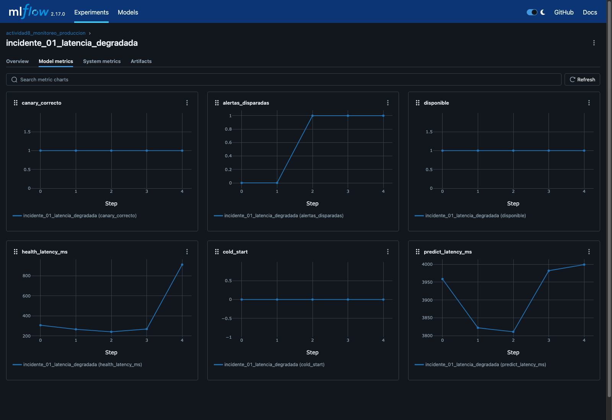
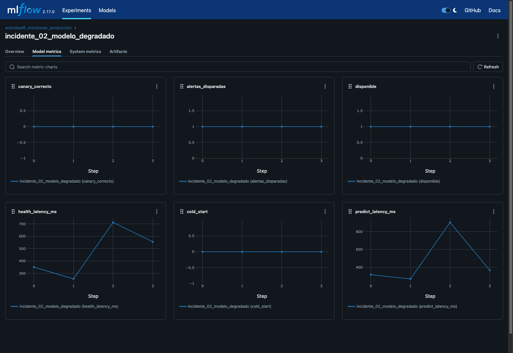
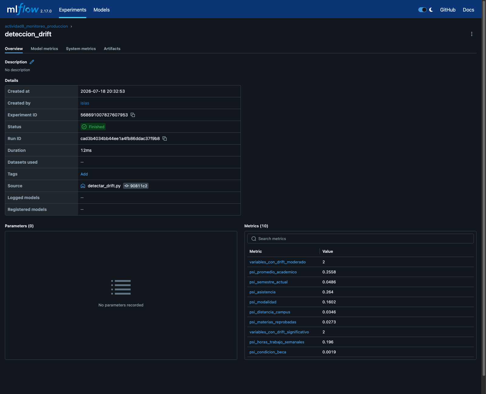

# Evidencia de Implementación — Actividad 8

> Consolida en un solo documento las capturas de MLflow, el reporte de detección de
> drift y el log de alertas disparadas durante el monitoreo real contra
> `https://fase2-abandono-escolar.onrender.com`. Los archivos originales (capturas
> PNG, `alertas_log.jsonl`, `reporte_drift.md`) se conservan en
> [`evidencia/`](evidencia/) como respaldo; este documento es la lectura de un solo
> tirón.

---

## 1. MLflow: lista de sesiones de monitoreo

Cada fila es una ejecución de `monitor.py`: línea base, cada incidente, y cada
verificación post-rollback.

---

## 2. MLflow: detalle de una corrida (incidente de latencia)

Parámetros (URL monitoreada, ciclos, intervalo), métricas finales, y el commit
exacto del código (`monitor.py`) que generó la corrida — trazabilidad entre código y
resultado observado.

---

## 3. Dashboard de métricas — Incidente 1 (latencia degradada)

Seis gráficas por ciclo. `predict_latency_ms` se sostiene en ~3800-4000ms (vs.
~300ms de línea base) y `alertas_disparadas` sube de 0 a 1 en el ciclo 2.

---

## 4. Dashboard de métricas — Incidente 2 (modelo degradado)

`canary_correcto` queda en 0 de forma constante y `alertas_disparadas` en 1 desde el
primer ciclo — a diferencia del incidente 1, esta falla es inmediata, no requiere
ciclos consecutivos para confirmarse.

---

## 5. Detección de data drift

Comparación: `data/dataset_abandono.csv` (entrenamiento) vs
`dataset_produccion_con_drift.csv` (producción simulada, con drift deliberado en 4
variables):

| Variable | PSI | Clasificación | Media referencia | Media producción |
|---|---|---|---|---|
| `asistencia` | 0.2640 | **Significativo** | 0.841 | 0.779 |
| `promedio_academico` | 0.2558 | **Significativo** | 7.157 | 6.555 |
| `horas_trabajo_semanales` | 0.1960 | Moderado | 10.405 | 16.593 |
| `modalidad` | 0.1602 | Moderado | 0.237 | 0.423 |
| `semestre_actual` | 0.0486 | Sin drift | 4.928 | 4.863 |
| `distancia_campus` | 0.0346 | Sin drift | 14.658 | 15.427 |
| `materias_reprobadas` | 0.0273 | Sin drift | 1.249 | 1.403 |
| `condicion_beca` | 0.0019 | Sin drift | 0.313 | 0.333 |

**Resultado:** 2 variables con drift significativo, 2 con drift moderado, 4 sin
drift — coincide exactamente con las 4 variables donde se introdujo el cambio
deliberado y las 4 que se dejaron intactas. `ALERT-DRIFT-01` disparada.

---

## 6. Log de alertas disparadas (resumen legible)

Registro completo en [`evidencia/alertas_log.jsonl`](evidencia/alertas_log.jsonl)
(formato JSONL, una línea por alerta). Resumen:

| Hora (UTC) | Alerta | Severidad | Latencia / Canary en ese ciclo | Runbook |
|---|---|---|---|---|
| 02:21:48 | `ALERT-LAT-01` | P2 | `predict_latency_ms`=3810.9 | `runbook_latencia.md` |
| 02:22:04 | `ALERT-LAT-01` | P2 | `predict_latency_ms`=3982.0 | `runbook_latencia.md` |
| 02:22:20 | `ALERT-LAT-01` | P2 | `predict_latency_ms`=3999.1 | `runbook_latencia.md` |
| 02:26:51 | `ALERT-QUALITY-01` | P1 | canario bajo→clase 1 (esperado 0) | `runbook_modelo_degradado.md` |
| 02:27:00 | `ALERT-QUALITY-01` | P1 | canario bajo→clase 1 (esperado 0) | `runbook_modelo_degradado.md` |
| 02:27:09 | `ALERT-QUALITY-01` | P1 | canario bajo→clase 1 (esperado 0) | `runbook_modelo_degradado.md` |
| 02:27:20 | `ALERT-QUALITY-01` | P1 | canario bajo→clase 1 (esperado 0) | `runbook_modelo_degradado.md` |

7 alertas en total: 3 de latencia (P2, incidente 1) y 4 de calidad de modelo (P1,
incidente 2). Ninguna falsa alarma durante la línea base ni tras los rollbacks —
línea de tiempo completa con la respuesta a cada una en
[`incidentes/registro_incidentes.md`](incidentes/registro_incidentes.md).
