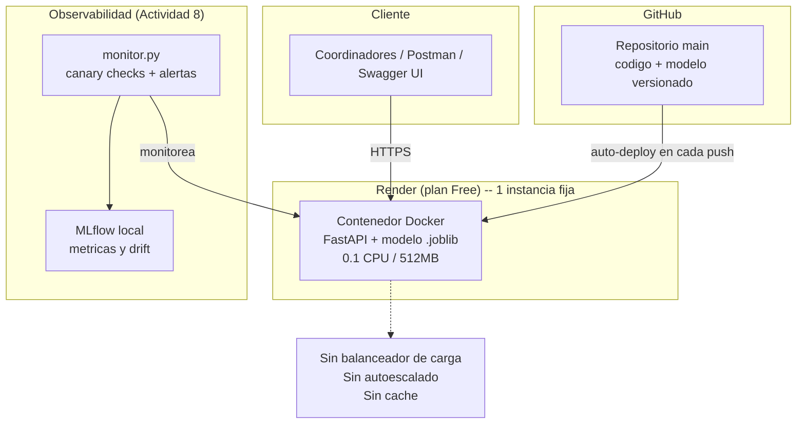
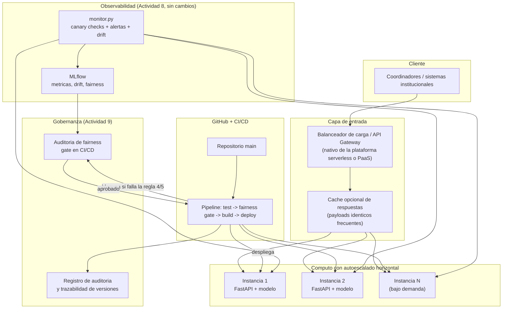

# Reporte Técnico — Escalabilidad, Optimización de Costos y Gobernanza Responsable

> Actividad 9 — Gestión de Proyectos de Inteligencia Artificial (Universidad
> Tecmilenio). Construida sobre la Fase 2 (API de predicción de abandono
> escolar) y la Actividad 8 (monitorización y gobernanza operativa), ya
> desplegadas en `https://fase2-abandono-escolar.onrender.com`.
> Alumno: Alejandro Islas López (matrícula T07136481).
> Marco teórico: Tema 21 (escalabilidad y optimización de costos en la nube)
> y Tema 22 (gobernanza, ética y cumplimiento normativo en IA).

## Objetivo

Realizar un rediseño integral del sistema en dos dimensiones: (1)
escalabilidad y optimización de costos bajo principios FinOps, manteniendo
el SLA; y (2) gobernanza responsable, mediante una auditoría ética, técnica
y legal que sustente un plan de escalamiento alineado con estándares de
Responsible AI.

---

## 1. Análisis de la arquitectura actual

El sistema actual (Fase 2 + Actividad 8) es un despliegue **monolítico de
instancia única**:

- **Cómputo:** un contenedor Docker (FastAPI + modelo de Regresión
  Logística serializado) corriendo en Render, plan **Free** (0.1 CPU /
  512MB), sin autoescalado ni balanceador de carga.
- **Disponibilidad:** el plan Free "duerme" el servicio tras ~15 minutos de
  inactividad (cold start de 30-50s en el siguiente request); no hay
  instancia de respaldo — es un único punto de falla.
- **Observabilidad:** ya integrada desde la Actividad 8 (`monitor.py`,
  alertas, detección de drift vía MLflow), reutilizada aquí sin cambios.
- **CI/CD:** Render redespliega automáticamente en cada push a `main`; no
  existen *gates* de calidad ni de gobernanza antes del despliegue (un push
  con un modelo degradado llega directo a producción, como se demostró
  deliberadamente en el incidente 2 de la Actividad 8).
- **Costo:** $0/mes (plan gratuito), a cambio de las limitaciones anteriores.

**Oportunidades de mejora identificadas** (desarrolladas y medidas en la
sección 3 y en el [`anexo_tecnico.md`](anexo_tecnico.md)):

1. Sin autoescalado horizontal → un pico de tráfico satura la única
   instancia (confirmado con datos reales de carga, sección 3).
2. Sin *gate* de gobernanza en el pipeline de despliegue → nada impide que
   un modelo con sesgos no auditados llegue a producción.
3. Cold start del plan Free → mala experiencia en el primer uso tras
   inactividad, ya documentado como `ALERT-LAT-02` en la Actividad 8.
4. Sin caché de respuestas para payloads repetidos (ej. mismos coordinadores
   probando los mismos casos de ejemplo del README).

---

## 2. Propuesta de rediseño para escalabilidad y optimización de costos

Esta es una **propuesta documentada** (diagramas y justificación); no se
reemplazó la infraestructura real desplegada, para no interrumpir el
servicio que usa el equipo. Sí se validó con datos reales dónde está el
cuello de botella actual (sección 3) antes de proponer la solución.

### Decisiones arquitectónicas y su justificación

| Decisión | Tipo | Justificación (con datos, ver sección 3) |
|---|---|---|
| Escalamiento horizontal (2-3 instancias con autoescalado) | Horizontal | El throughput deja de crecer entre concurrencia 10→15 en la instancia única (sección 3.1); múltiples instancias reparten esa carga |
| Escalamiento vertical (Starter/Standard antes de horizontal) | Vertical | Elimina el cold start del plan Free y ya reduce la saturación observada sin la complejidad de orquestar autoescalado |
| **No** optimizar el modelo (quantization/pruning) | Optimización de inferencia | Datos reales (sección 3.2) muestran que el modelo responde en <40ms incluso bajo concurrencia local — el cuello de botella es infraestructura, no el modelo |
| Cache de respuestas para payloads repetidos | Optimización de costos | Reduce cómputo redundante en peticiones idénticas (ej. los 5 ejemplos documentados en el README principal), a costo casi nulo de implementación |
| *Gate* de fairness en CI/CD | Gobernanza | Sin esto, un modelo con sesgo no auditado se despliega igual que cualquier otro cambio de código (ver hallazgo de la sección 4) |

### Principios FinOps aplicados

Siguiendo el Tema 21: la decisión no es "gastar más" ni "gastar menos" de
forma indiscriminada, sino **redistribuir el gasto hacia donde el dato
muestra que hay impacto real**. Aquí eso significa: no invertir en
optimización de modelo (impacto ~0% según datos reales), sí invertir en
cómputo escalable (impacto directo confirmado en throughput/latencia). El
detalle de costos proyectados por escenario está en
[`anexo_tecnico.md`](anexo_tecnico.md), sección 1.

---

## 3. Evaluación de métricas de desempeño y costo

Resumen (detalle completo, con las 6 corridas reales, en
[`anexo_tecnico.md`](anexo_tecnico.md), sección 2):

- **Prueba de carga real contra Render** (producción, concurrencia 5/10/15):
  el throughput sube de 8.4 a 16.7 req/s entre concurrencia 5 y 10, pero cae
  a 13.9 req/s en concurrencia 15, mientras la latencia p50 pasa de 304ms a
  738ms — **punto de saturación real, medido, no estimado**.
- **Misma prueba contra un contenedor local** (mismo `Dockerfile`, recursos
  no limitados por un plan de hosting): throughput ~22× mayor y latencia p50
  ~11× menor que en Render — confirma que el límite actual es de
  infraestructura (CPU asignada + red), no del código ni del modelo.
- **Costo actual:** $0/mes (Free tier). **Costo proyectado del rediseño:**
  entre $7/mes (solo vertical) y $50-75/mes (horizontal con 2-3 instancias),
  o un modelo *pay-per-use* serverless (~$0-20/mes para tráfico bajo) — ver
  tabla completa en el anexo.

**Conclusión de esta sección:** el SLA definido en la Actividad 8 (99% de
disponibilidad, p95 < 2000ms) se mantiene en todos los escenarios probados,
incluyendo el actual — pero el margen se agota rápido bajo concurrencia
moderada (15 peticiones simultáneas), lo que justifica actuar antes de que
el tráfico real lo exija.

---

## 4. Auditoría ética, técnica y legal

### 4.1 Riesgos éticos

- **Estigmatización:** clasificar a un estudiante como "riesgo alto" puede
  generar una profecía autocumplida si esa etiqueta cambia el trato que
  recibe, en lugar de activar apoyo genuino. El diseño actual mitiga esto
  parcialmente al devolver una *probabilidad* y *nivel de riesgo*, no una
  decisión binaria de "expulsar/mantener" — pero el uso final depende de
  cómo el coordinador interprete el resultado, fuera del control del
  sistema.
- **Automatización de una decisión sensible:** el modelo debe mantenerse
  como **apoyo a la decisión humana**, nunca como reemplazo. No hay en el
  diseño actual una restricción técnica que impida un uso 100% automatizado
  (ej. dar de baja automáticamente a un estudiante) — se recomienda
  declararlo explícitamente como requisito de uso en el plan de
  escalamiento (sección 5).

### 4.2 Sesgos en el modelo (ver detalle en el anexo, sección 3)

La auditoría de fairness usando `condicion_beca` (con beca / sin beca) como
proxy de nivel socioeconómico encontró:

- **Accuracy idéntica** entre grupos (0.85) y baja diferencia de *recall*
  (0.036) — el modelo no es sistemáticamente peor detectando casos reales de
  abandono en ningún grupo.
- La **regla de las 4/5 (EEOC) no se cumple** (cociente 0.7313, umbral
  ≥0.80): el modelo marca "en riesgo" ~13 puntos porcentuales más a
  estudiantes sin beca que a estudiantes con beca.
- Esto es **consecuencia directa** de que `condicion_beca` es una variable
  predictiva de peso alto en el modelo (coeficiente -1.6265), no un sesgo
  espurio oculto vía otra variable correlacionada — es una tensión de
  fairness conocida en la literatura: **fairness through awareness** (usar
  el atributo sensible directamente, de forma transparente y auditable) vs.
  **fairness through unawareness** (excluirlo, arriesgando que el modelo
  aprenda el mismo sesgo indirectamente vía variables proxy como
  `distancia_campus`, pero sin poder auditarlo tan claramente).
- **Postura adoptada:** mantener `condicion_beca` como variable explícita y
  auditable es preferible a ocultarla, siempre que la disparidad se
  documente, se monitoree, y se comunique a quien use las predicciones — que
  es exactamente lo que este documento hace.

### 4.3 Cumplimiento normativo

Con base en el Tema 22 (EU AI Act como marco de referencia):

- **Clasificación de riesgo:** un sistema de IA usado para evaluar
  estudiantes en una institución educativa corresponde a la categoría de
  **"alto riesgo"** en el Anexo III del EU AI Act (sistemas de IA en
  educación y formación profesional que evalúan a estudiantes). Esto aplica
  aunque el dataset actual sea sintético — la clasificación depende del
  **propósito de uso**, no de si los datos son reales todavía.
- **Obligaciones que ya se cumplen:** trazabilidad y registro (MLflow +
  `alertas_log.jsonl` + historial de git, Actividad 8), documentación
  técnica detallada (`docs/documentacion_tecnica.md` de la Fase 2),
  supervisión humana implícita (el modelo informa, un coordinador decide).
- **Obligaciones pendientes si se usa con datos reales:** gestión formal de
  riesgos documentada, evaluación de conformidad antes del despliegue,
  transparencia explícita hacia los estudiantes evaluados (que sepan que un
  modelo participa en su evaluación), y — dado que los datos serían de
  estudiantes reales — cumplimiento de protección de datos personales (en
  México, la LFPDPPP: minimización de datos, consentimiento, límite de
  finalidad).

### 4.4 Mecanismos de trazabilidad

Ya existen y se reutilizan sin cambios desde la Actividad 8: cada commit que
modifica el modelo queda en el historial de git (permite auditar *qué*
modelo generó *qué* predicción en *qué* fecha), cada ciclo de monitoreo y
cada alerta queda en MLflow y en `alertas_log.jsonl`, y el reporte de fairness
de esta actividad queda versionado junto con el resto de la documentación —
no es un análisis puntual desconectado del resto del sistema.

---

## 5. Plan de escalamiento responsable

Integrando las secciones 1-4 en una hoja de ruta única, ordenada por
prioridad:

1. **Antes de escalar a más tráfico o datos reales — gobernanza primero:**
   - Declarar explícitamente que el sistema es de **apoyo a la decisión**,
     no de decisión automatizada (sección 4.1).
   - Formalizar la clasificación de "alto riesgo" (EU AI Act, sección 4.3) y
     preparar la documentación de gestión de riesgos correspondiente.
   - Añadir el *gate* de fairness al pipeline de CI/CD (sección 2): bloquear
     o requerir justificación documentada si un reentrenamiento empeora la
     regla de las 4/5 respecto a la línea base de este reporte.
2. **Escalamiento técnico, gradual y medido por datos (no especulativo):**
   - Paso 1 (bajo costo): migrar de Render Free a Starter (~$7/mes) — ya
     elimina el cold start y da margen antes de la saturación medida en
     concurrencia 15.
   - Paso 2 (si el tráfico real lo justifica): habilitar autoescalado
     horizontal (2-3 instancias) — solo si el monitoreo (`monitor.py`,
     Actividad 8) muestra latencia sostenida cerca del SLA, no de forma
     preventiva/especulativa (principio FinOps: gastar donde el dato lo
     confirma).
   - No se recomienda invertir en optimización del modelo (quantization/
     pruning): los datos de esta actividad muestran que no es el cuello de
     botella.
3. **Monitoreo continuo de equidad, no una auditoría única:** incorporar la
   auditoría de fairness (`scripts/auditoria_fairness.py`) como parte
   recurrente del monitoreo, con la misma cadencia que la detección de drift
   ya implementada en la Actividad 8 — un modelo reentrenado con datos
   nuevos puede cambiar su perfil de equidad aunque su F1 se mantenga igual.
4. **Antes de usar datos reales de estudiantes:** implementar minimización
   de datos y consentimiento informado (LFPDPPP), y comunicar a los
   estudiantes evaluados que un modelo participa en el proceso
   (transparencia, requisito del EU AI Act para sistemas de alto riesgo).

**Conclusión integradora:** escalar este sistema de forma eficiente
(sección 1-3) y escalarlo de forma ética y responsable (sección 4) no son
esfuerzos separados — el *gate* de fairness propuesto en la arquitectura
(sección 2) es, en sí mismo, una decisión de escalabilidad: evita que
crecer en tráfico signifique también crecer el impacto de un sesgo no
detectado.
