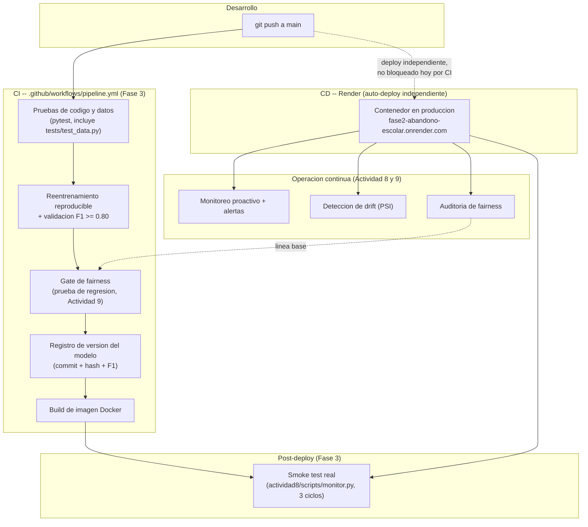

# Documento Técnico de Operación — Fase 3

> Gestión de Proyectos de Inteligencia Artificial (Universidad Tecmilenio).
> Consolida en un solo documento de operación lo construido en la Fase 2
> (modelo + API), la Actividad 8 (monitorización y gobernanza operativa) y
> la Actividad 9 (escalabilidad y gobernanza responsable), más lo nuevo de
> la Fase 3: el pipeline automatizado que las conecta.
> Alumno: Alejandro Islas López (matrícula T07136481).

## Objetivo

Verificar que la solución sea **funcional, escalable, mantenible y
comunicable** en un entorno real, documentando la arquitectura completa, los
mecanismos de monitoreo y auditoría ya operando, las métricas clave
obtenidas, y las acciones de optimización efectivamente realizadas — no solo
propuestas.

---

## 1. Arquitectura de la solución

### 1.1 Componentes del sistema

| Componente | Función | Origen |
|---|---|---|
| `src/` (API + modelo) | Servicio de inferencia (FastAPI + Regresión Logística) | Fase 2 |
| Render (PaaS) | Hosting del contenedor, auto-deploy en push a `main` | Fase 2 |
| `actividad8/scripts/monitor.py` | Monitoreo proactivo (canary checks, latencia, disponibilidad) | Actividad 8 |
| `actividad8/scripts/detectar_drift.py` | Detección de data drift (PSI) | Actividad 8 |
| `actividad9/scripts/auditoria_fairness.py` | Auditoría de sesgos (regla 4/5, demographic parity) | Actividad 9 |
| MLflow (local) | Tracking de experimentos, monitoreo y auditorías | Actividad 8/9 |
| **`.github/workflows/pipeline.yml`** | **Integración continua: pruebas, reentrenamiento validado, gate de fairness, build, registro de versión** | **Fase 3 (nuevo)** |
| **`fase3/scripts/gate_fairness.py`** | **Gate de gobernanza: bloquea regresiones de fairness en CI** | **Fase 3 (nuevo)** |
| **`fase3/scripts/registrar_version_modelo.py`** | **Registro de versiones de modelo/artefactos basado en git** | **Fase 3 (nuevo)** |

### 1.2 Diagrama de arquitectura (estado actual, con el pipeline integrado)

**Nota de diseño honesta:** la flecha punteada de `A` a `C` refleja que, hoy,
el pipeline de CI y el despliegue de Render corren **en paralelo, no en
serie** — el push dispara ambos al mismo tiempo, pero uno no depende del
otro. Esto es una decisión documentada, no un descuido: activarlo como gate
real requiere *branch protection* en GitHub, lo cual cambia el flujo de
trabajo del equipo (de push directo a `main`, a Pull Requests). Se dejó como
mejora recomendada (sección 5) en lugar de activarla unilateralmente.

---

## 2. Mecanismos de monitoreo implementados

Sin cambios respecto a la Actividad 8 (reutilizados, no reconstruidos):

- **`monitor.py`**: canary checks (2 casos de referencia con clase esperada
  conocida) + medición de latencia/disponibilidad en cada ciclo, registrado
  como serie de tiempo en MLflow.
- **`alertas_config.yaml`**: 5 reglas de alerta con severidad P1-P3 y SLOs
  explícitos (99% disponibilidad, p95 < 2000ms, 100% canary checks).
- **Novedad de la Fase 3**: un job de CI (`smoke-test-produccion`) ejecuta
  3 ciclos de `monitor.py` contra la URL real **después de cada push a
  `main`**, como verificación automatizada de que el despliegue de Render
  efectivamente sucedió y el servicio responde — antes esto se hacía
  manualmente (`curl` después de cada push, como se hizo repetidamente en la
  Actividad 8).

## 3. Estrategias de auditoría

| Auditoría | Qué revisa | Cuándo corre |
|---|---|---|
| Drift de datos (PSI) | ¿Los datos de producción se parecen a los de entrenamiento? | Manual (Actividad 8), bajo demanda |
| Fairness (`condicion_beca`) | ¿El modelo trata equitativamente a ambos grupos? | Manual (Actividad 9) + **automatizada en CI (Fase 3, cada push)** |
| Gate de fairness (CI) | ¿Un cambio de modelo empeora la disparidad ya documentada? | **Automática, en cada push/PR (Fase 3)** |
| Validación de datos | ¿El dataset cumple el contrato de `EstudianteEntrada`? | **Automática, en cada push/PR (Fase 3, `tests/test_data.py`)** |

La diferencia clave que aporta la Fase 3: las auditorías de la Actividad 8/9
eran ejercicios puntuales, ejecutados a mano y documentados una vez. Ahora
**dos de ellas corren automáticamente en cada cambio al repositorio**,
convirtiendo una auditoría única en un control continuo — la definición
misma de gobernanza operativa, no solo un análisis de punto en el tiempo.

## 4. Métricas clave de desempeño

Consolidado de las tres actividades (todas con evidencia real, no
estimada):

| Métrica | Valor | Fuente |
|---|---|---|
| F1 (modelo, prueba) | 0.8493 | Fase 2 / validado en cada corrida de CI (Fase 3) |
| Disponibilidad observada | 100% (0 fallos en todos los ciclos de monitoreo) | Actividad 8 |
| Latencia p50 (Render, concurrencia 10) | 304 ms | Actividad 9 |
| Throughput máximo sostenido (Render) | ~16.7 req/s (concurrencia 10; cae en 15) | Actividad 9 |
| Cociente regla 4/5 (fairness) | 0.7313 (por debajo de 0.80, explicado y monitoreado) | Actividad 9 / gate de CI (Fase 3) |
| Duración del pipeline de CI | 4m 26s (ambos jobs) | Fase 3, run real \#1 (ver `evidencia/capturas/`) |

## 5. Acciones de optimización realizadas

Distinción importante: la Actividad 9 **propuso** varias optimizaciones sin
implementarlas (decisión explícita en su momento, para no interrumpir el
servicio). La Fase 3 **implementa** las que tenían mejor relación
costo/beneficio y no requerían tocar la infraestructura de producción:

| Optimización | Estado | Justificación |
|---|---|---|
| Autoescalado horizontal | Sigue como propuesta (Actividad 9) | Requiere costo adicional (~$50-75/mes); no justificado hasta que el tráfico real lo exija (principio FinOps) |
| Optimización del modelo (quantization/pruning) | Descartada explícitamente | Datos reales muestran que no es el cuello de botella (Actividad 9, anexo sección 2) |
| **Pruebas automatizadas de datos y código en cada push** | **Implementado (Fase 3)** | Costo casi nulo (GitHub Actions es gratuito en repos públicos); cierra una brecha real (nada validaba el dataset antes de entrenar) |
| **Gate de fairness continuo** | **Implementado (Fase 3)** | Convierte una auditoría puntual en un control recurrente, sin costo de infraestructura adicional |
| **Registro de versiones de modelo** | **Implementado (Fase 3)** | Usa git como registro (sin operar infraestructura dedicada) — decisión FinOps consistente con el resto del proyecto |
| Branch protection (gate real de despliegue) | Recomendada, no activada | Cambia el flujo de trabajo del equipo; se deja como decisión explícita pendiente, no implícita |

---

## 6. Evidencia

- Run exitoso del pipeline completo (ambos jobs, 4m26s):
  [`evidencia/capturas/01_pipeline_run_exitoso.png`](evidencia/capturas/01_pipeline_run_exitoso.png)
- Detalle de los 13 pasos del job principal, todos en verde:
  [`evidencia/capturas/02_pasos_del_pipeline.png`](evidencia/capturas/02_pasos_del_pipeline.png)
- Historial de incidentes reales operados (Actividad 8):
  [`../actividad8/incidentes/registro_incidentes.md`](../actividad8/incidentes/registro_incidentes.md)
- Auditoría de fairness completa (Actividad 9):
  [`../actividad9/anexo_tecnico.md`](../actividad9/anexo_tecnico.md), sección 3
