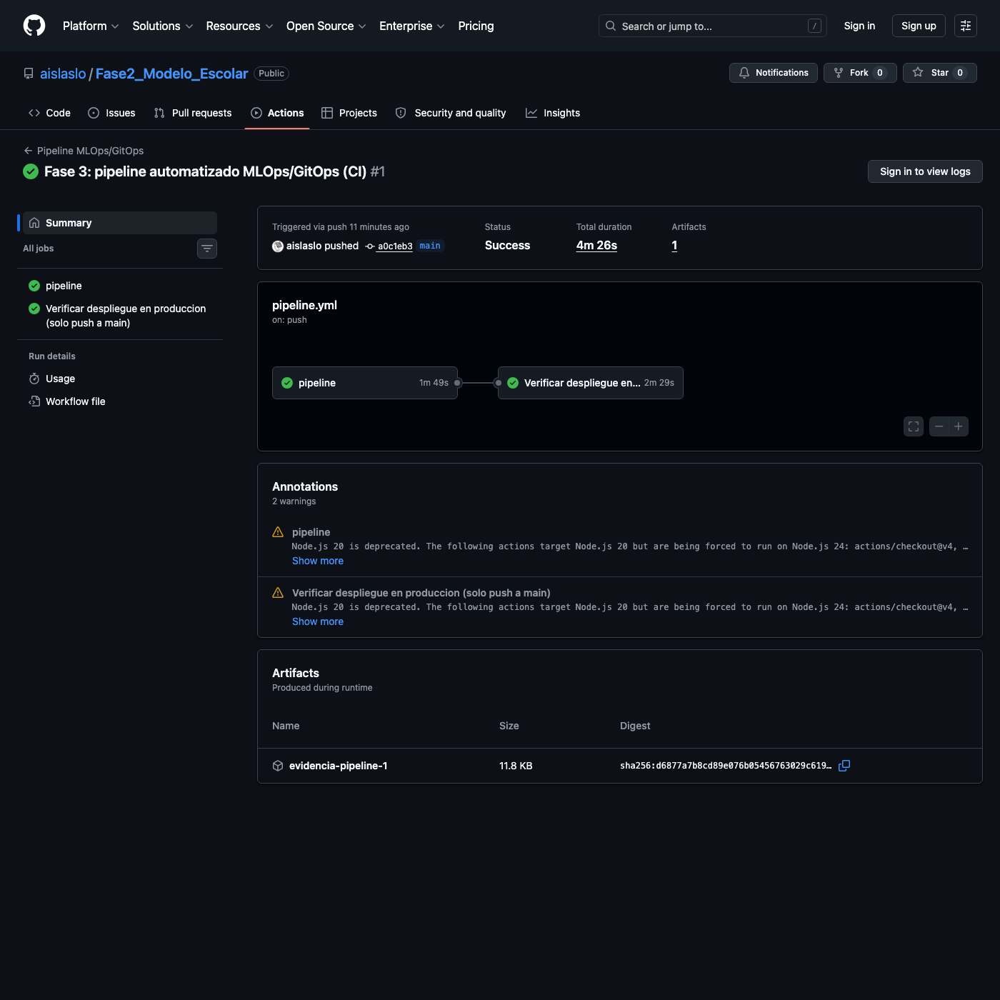
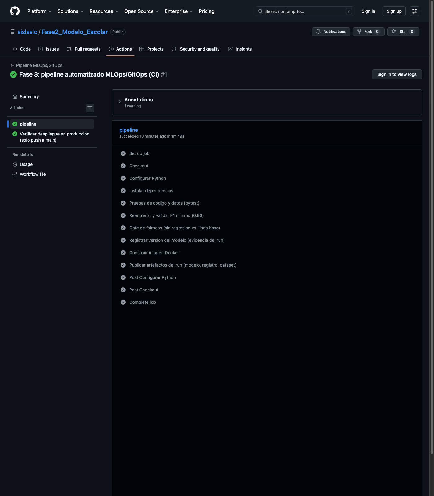
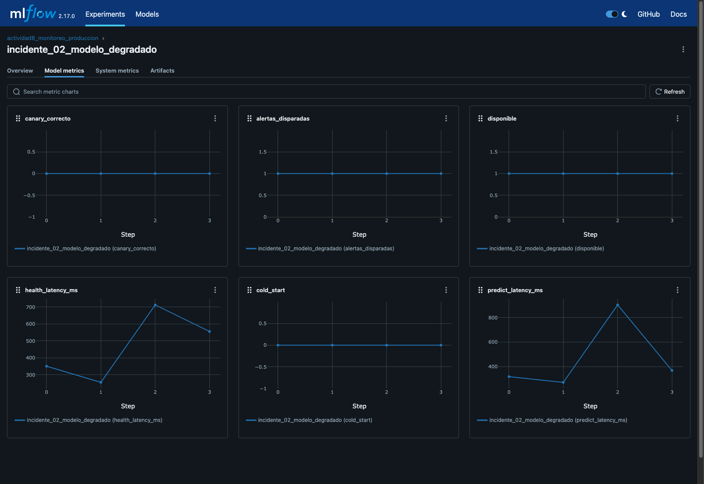
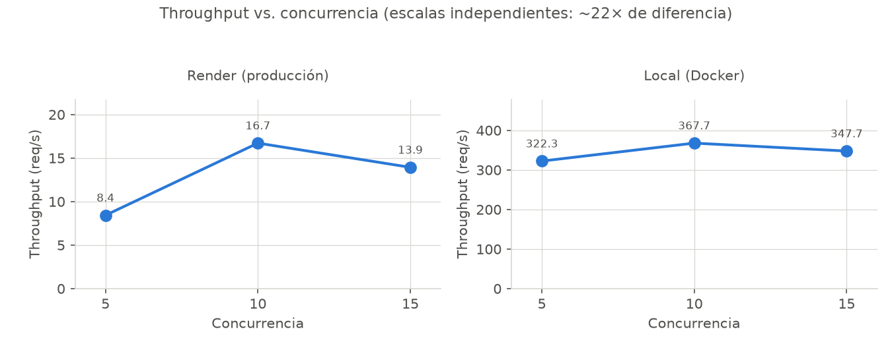

# 🎓 Sistema de Predicción de Abandono Escolar

### De notebook a producción: un sistema de IA operado, auditado y automatizado — no solo entrenado

**[🚀 API en vivo](https://fase2-abandono-escolar.onrender.com)** &nbsp;·&nbsp;
**[📖 Swagger Docs](https://fase2-abandono-escolar.onrender.com/docs)** &nbsp;·&nbsp;
**[💻 Repositorio](https://github.com/aislaslo/Fase2_Modelo_Escolar)** &nbsp;·&nbsp;
**[📋 Documento de operación](documento_operacion.md)**

 

 

> Alejandro Islas López · Gestión de Proyectos de Inteligencia Artificial,
> Universidad Tecmilenio

Estructurado según el modelo de portfolio por capas (Base → Crecimiento →
Innovación): cada capa representa un nivel de madurez profesional distinto,
no solo un conjunto de entregables cronológicos.

---

## 🎯 Resumen ejecutivo

> Un servicio de predicción de riesgo de abandono escolar, llevado de
> notebook de experimentación a **API en producción, monitoreada, auditada
> por sesgos, y con un pipeline de integración continua que valida cada
> cambio antes de que llegue a producción**.

No es un proyecto de clase aislado: es un sistema con las mismas piezas
operativas que se esperan de un modelo de ML en la industria — CI/CD,
observabilidad, gobernanza y trazabilidad — construidas de forma incremental
y siempre con **evidencia real** de que funcionan, no solo documentadas en
teoría.

## 🧩 El problema de negocio

Las instituciones educativas identifican tarde a los estudiantes en riesgo
de abandonar, cuando la intervención ya es menos efectiva. Un modelo
predictivo que estima ese riesgo a partir de variables académicas y
socioeconómicas permite a los coordinadores priorizar el acompañamiento
**antes** de que el estudiante abandone, no después. El valor de negocio no
es el modelo en sí — es la ventana de tiempo que le devuelve a la
institución para actuar.

## 🏗️ Arquitectura por capas

### 🧱 Base — Fundamentos técnicos sólidos ([Fase 2](../README.md))

- Modelo de Regresión Logística (**F1 = 0.8493**, por encima del objetivo
  SMART de 0.80), entrenado sobre un pipeline reproducible (`src/train.py`).
- API REST (FastAPI) con contrato de datos validado (Pydantic), contenerizada
  con Docker.
- Desplegada realmente en producción (Render), no solo localmente —
  documentado end-to-end en `docs/manual_despliegue.md`.

### 🌱 Crecimiento — Operación y responsabilidad en el mundo real ([Actividad 8](../actividad8/) y [Actividad 9](../actividad9/))

- **Monitoreo proactivo real**: 2 incidentes simulados *deliberadamente*
  contra la producción real (latencia degradada, modelo degradado),
  detectados por alertas automatizadas y resueltos con runbooks ejecutados
  de verdad — no un ejercicio de escritorio.
- **Escalabilidad basada en datos, no en intuición**: prueba de carga real
  contra producción que identificó el punto exacto de saturación de la
  infraestructura actual (concurrencia 10-15).
- **Auditoría de fairness real**: se encontró y documentó honestamente que
  el modelo no cumple la regla de las 4/5 (EEOC) entre estudiantes con y
  sin beca — y se explicó la causa exacta (peso legítimo de esa variable en
  el modelo), en vez de ocultar el hallazgo.

### 🚀 Innovación — Automatización y gobernanza continua ([Fase 3](../fase3/), este documento)

- **Pipeline de CI/CD real** (GitHub Actions): en cada push, valida código,
  datos, reentrena de forma reproducible, corre un *gate* de fairness (que
  reutiliza la auditoría de la Actividad 9 como prueba de regresión, no
  como ejercicio nuevo), construye la imagen Docker, y registra la versión
  del modelo.
- Convierte auditorías que antes eran puntuales (una vez, a mano) en
  controles que corren automáticamente en cada cambio al repositorio.

## 📊 Resultados alcanzados

| Resultado | Valor |
|---|---|
| ✅ F1 del modelo (objetivo ≥ 0.80) | **0.8493** |
| ✅ Incidentes simulados en producción, detectados y resueltos | **2/2** |
| ✅ Pruebas automatizadas (código + datos) | **18**, 100% pasan |
| ✅ Runs de CI/CD ejecutados con éxito | ver galería abajo |
| ✅ Disponibilidad observada en monitoreo | **100%** |

## 🖼️ Evidencia visual

<table>
<tr>
<td width="50%" valign="top">

**✅ Pipeline de CI/CD exitoso**

Ambos jobs en verde, 4m26s de principio a fin — GitHub Actions real, no
simulado.

</td>
<td width="50%" valign="top">

**🔍 13 pasos, cada uno verificado**

Pruebas, reentrenamiento, gate de fairness, build de Docker, registro de
versión.

</td>
</tr>
<tr>
<td width="50%" valign="top">

**🚨 Incidente real detectado**

`canary_correcto=0` desde el primer ciclo — provocado y resuelto contra
producción real, no en papel.

</td>
<td width="50%" valign="top">

**📈 Prueba de carga real**

Punto de saturación de la infraestructura, medido contra producción — no
estimado.

</td>
</tr>
</table>

## 🛠️ Stack tecnológico

| Categoría | Herramientas |
|---|---|
| Modelado | scikit-learn, pandas, joblib |
| API | FastAPI, Uvicorn, Pydantic |
| Contenerización | Docker |
| Despliegue | Render (PaaS) |
| Tracking / experimentos | MLflow |
| CI/CD | GitHub Actions |
| Pruebas | pytest (código y datos) |
| Visualización | Matplotlib, Mermaid |

## 💡 Narrativa estratégica

Lo que distingue a este proyecto no es un modelo con métricas altas — eso es
el punto de partida esperado. Lo que aporta valor estratégico es que **cada
afirmación tiene evidencia de ejecución real detrás**: los incidentes se
provocaron y resolvieron de verdad contra producción, el sesgo del modelo
se midió y se explicó en vez de ignorarse, y el pipeline de automatización
se verificó corriendo, no solo se escribió. Esa disciplina — construir,
medir, y solo entonces afirmar — es exactamente lo que un equipo de
ingeniería de ML necesita de alguien que se incorpore a operar sistemas de
IA en producción, no solo a entrenar modelos.

---

**[⬆ Volver arriba](#-sistema-de-predicción-de-abandono-escolar)**

